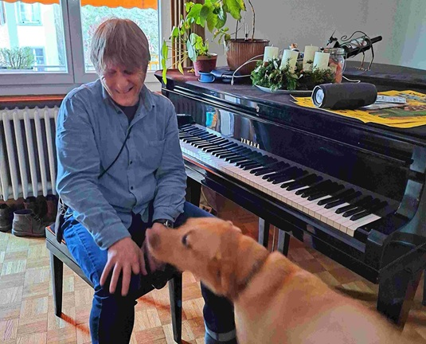

+++
title = "«Ich bin trotzdem voller Bilder»"
date = "2024-02-26"
draft = false
pinned = false
image = "alexander-wyy.jpg"
+++


Ein Unfall nahm ihm mit 20 Jahren das Augenlicht. Der leidenschaftliche Jazzpianist und Lehrer Alexander Wyssmann ist seither blind, lebt aber nicht in der Dunkelheit. 



Elina Stähli, Carla Guggisberg

In einem Quartier, etwas ausserhalb der Stadt Bern, wohnt der 54- jährige Alexander Wyssmann. Bei einem Unfall in der Rekrutenschule verlor er sein Augenlicht. Seither ist er blind, lebt aber, wie er sagt, nicht in der Dunkelheit, sondern eher im Zwielicht. Nebst seiner Arbeit als Lehrer an der Blindenschule Zollikofen, spielt er leidenschaftlich Klavier. 

#### **Wir haben im Museum das Zitat «Ich habe den Eindruck, dass ich gleich gut sehe wie früher, als ich noch mit den Augen sah – es sind einfach andere Kanäle, die ich nutze» von Ihnen gelesen, können Sie uns erklären, was Sie damit meinen?**

Das Sehen ist einfach einer von fünf Sinnen. Die meisten Menschen stellen sich vor, dass im Kopf dann ein Defizit herrscht, aber das ist nicht so. Man gewöhnt sich daran und der Kopf stellt sich um. Die Bilder, die zuvor durchs Sehen entstanden sind, bilden sich jetzt durch die anderen Sinne und so nehme ich Dinge wahr. Viele denken, dass es einfach finster ist, aber das ist nicht so, ich bin voller Bilder. Ich träume immer noch mit Bildern, ich weiss aber, dass es sich verändert hat. Also wenn ich träume, dann brauche ich auch dort Hilfsmittel, ich bin auch im Traum blind.

> 1. *«Ich hatte nie das Gefühl, ich hätte weniger Bilder im Kopf.*» *(Alexander Wyssmann)*

#### **Uns würde interessieren, ob Sie bei der Idee und beim Aufbau des Museums dabei waren und ob Sie gewisse Dinge mitbestimmen durften?**

Nein, überhaupt nicht. Ich wurde angefragt, ob ich einen Beitrag für das Museum leisten möchte und jetzt bin ich mit einem Audiobeitrag und Bildern im Museum verewigt. 
Mit dem Blindenmuseum wollte man zwei Fliegen mit einem Klatsch schlagen. Täglich werden wir mit Besucheranfragen überhäuft. Ausserdem wollte man mit vielen alten Materialien der Blindenschule, die Veränderungen und Entwicklung der Geschichte und der Pädagogik der Öffentlichkeit zugänglich machen. Die Idee ist, dass die Museumsbesuchenden interaktiv eigene Sinneserfahrungen sammeln und sich somit an ein Leben ohne Augenlicht herantasten können. 

#### **Wie war die Zeit nach der Erblindung für Sie und wie haben Sie sich zurechtgefunden?**

Menschen mögen keine Veränderungen und als ich mit 20 Jahren erblindete, stand ich dann da mit einer Persönlichkeit, die sich über die Jahre hinweg geformt hatte. Zuerst war ich sehr verunsichert, ich wusste nicht wie ich auf Menschen wirkte und ich musste viele meiner Einstellungen überdenken. Viele Leute meinen, dass sich eine Blindheit anfühlt, als würde man die Augen schliessen, aber so ist es nicht. Am Anfang war vor allem die Angst das Problem. Vor dem Unfall dachte ich immer, Menschen mit einer Beeinträchtigung wären nicht vollständig und plötzlich war ich selbst davon betroffen und fühlte mich nicht mehr vollkommen. Ich bin zusammengebrochen und alles in mir ist eingestürzt. Danach ging ich zu einer psychologischen Beratung und innerhalb von knapp zwei Jahren konnte ich mich so annehmen, wie ich bin und dann ging alles eigentlich ziemlich gut. Ich musste lernen, mit meiner Behinderung zu leben. 

> *«Ich dachte, ich müsste viel besser oder gescheiter sein als alle anderen und alles viel schneller machen, damit ich wieder ein vollständiger Mensch bin.»* (Alexander Wyssmann)

#### **Ihre Band heisst “twilight-trio”, wie sind Sie auf den Namen gekommen und was bedeutet er für Sie?**

Ich kam auf die Idee, da die meisten Menschen denken, blinde Menschen leben in einer Dunkelheit und das ist nicht wahr. Man ist eher wie im Zwielicht. Das gab mir die Inspiration für unseren Bandnamen. Mit zwei Kollegen trete ich nun unter dem Namen “twilight-trio” auf.\
Ich mag es ein Konzert zu spielen, wenn ich gut vorbereitet bin. Zuerst bin ich angespannt und voller Adrenalin. Aber nach einem geglückten Start, kann ich mit der Musik wie auf einer Welle surfen.

#### **Wie sieht ein Arbeitsalltag von Ihnen aus?**

Momentan arbeite ich 65%, damit ich noch ein bisschen Zeit für die Musik habe. Ich stehe am Morgen früh auf, frühstücke und gehe mit meinem Hund auf das Tram. In der Blindenschule Zollikofen angekommen, unterrichte ich dann kleine Gruppen oder einzelne Kinder und Jugendliche. 

#### **Welche Hilfsmittel sind für Sie im Alltag besonders wichtig?**

Wenn ich aus dem Haus gehe, nehme ich meistens mein Hund oder den Blindenstock mit. Heutzutage sind mein Smartphone und das Tablet kaum mehr wegzudenken. Einige Apps, beispielsweise Seeing AI, sind sehr wichtig für mich und helfen mir im Alltag enorm.

#### **Was würden Sie sich von sehenden Menschen wünschen?**

Ich wünsche mir, dass die Barrierefreiheit als Selbstverständlichkeit angeschaut wird und Menschen mit Beeinträchtigungen sich im Alltag frei bewegen können. An einigen Orten gibt es das zwar, aber das ist nicht so einfach. Z.B. Internetbestellungen oder tabellarische Darstellungen, die nicht Barriere-frei sind, erschweren den Alltag. 



Alexander Wyssmann ist im Jahr 1969 geboren und wuchs in einer Handwerkerfamilie auf. Schon als Kind interessierte er sich für Musik. Im Jahr 2009 schloss er das Studium als Jazzpianist an der Haute École in Lausanne ab. Seit dem Jahr 2005 spielt er Piano in der eigenen Jazzband “twilight-trio”. Heute wohnt er mit seiner Partnerin und seinem Hund Garrit in Bern und arbeitet als Lehrer und Heilpädagoge an der Blindenschule Zollikofen. 

