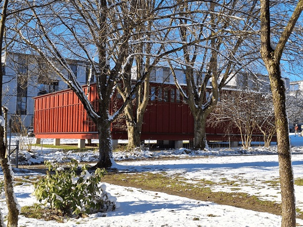
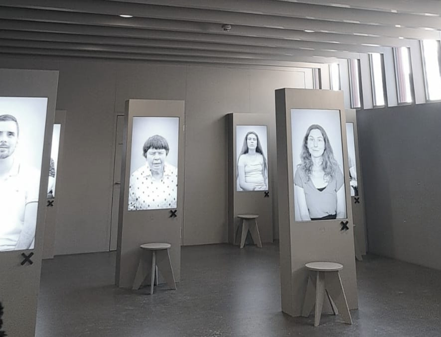

+++
title = "Eine Welt im Zwielicht"
date = "2024-02-25"
draft = false
pinned = false
image = "blindenmuseum_komp.jpg"
+++
«Anders sehen» auch wenn alles dunkel ist? Das ist in diesem einzigartigen Lernort möglich. Mitten in einem Wohnquartier von Zollikofen steht es seit 2020 im neuen Kleid: Das Schweizerische Blindenmuseum. Für einen Moment lässt man alle Farben hinter sich, experimentiert mit einem Blindenstock und versucht sich in der Dunkelheit zu orientieren. 

Elina Stähli, Carla Guggisberg

Rostbraun gefärbt, kaum Fenster, das moderne Gebäude passt nicht ins Bild. Im ersten Augenblick erinnert es eher an einen Lagerraum, eine Notunterkunft oder an einen Kindergarten. Doch wer einen Blick ins Innere des Gebäudes wirft, merkt bald, dass es sich um ein Museum handelt. Zwischen Wohnhäusern versteckt und umgeben von Bäumen und Wiese findet das Schweizerische Blindenmuseum in Zollikofen seinen Platz. Ein Museum etwas anderer Art: Teure Gemälde, Skulpturen oder Diamanten hinter Glaswänden sind nicht zu finden. Stattdessen gestaltet das Museum einen Ort, an dem Berühren erlaubt ist und Barrierefreiheit als Selbstverständlichkeit gilt.  Nach dem Leitsatz „anders sehen“, wird den Museumsbesuchenden das Thema „Blindheit“ sichtbar gemacht und ein Verständnis für Menschen, die nicht oder nur eingeschränkt sehen können, vermittelt.

**Eintönige Farbe- bunt gemischte Einblicke**
Ein kurzes Klicken, die Tür zum Museum öffnet sich. Ein Geruch schweift entgegen, etwas süßlich, «so wie es in einem Museum halt riecht», beschreibt es der 10-jährige Andrin. Er ist einer der wenigen Museumsbesuchenden an diesem Sonntagnachmittag und lernt gerade, wie man mit einem Blindenstock umgeht. Mit einer Schlafmaske und einem etwas zu großen Blindenstock tritt er auf die Leitlinien in der Eingangshalle. Den Blindenstock hin und her bewegend folgt er den Linien bis zur Kasse. Die vier parallelen Striche am Boden weisen auf ein Objekt hin, Andrin hält an, zieht die Maske vom Gesicht und öffnet seine Augen. Eine Eingangshalle erscheint in Grau. Die Wände, die Kasse, die kleine Garderobe, alles in derselben Farbe. «Das schlichte Grau wurde bewusst gewählt, so können sich sehende Personen ein wenig in die Welt ohne Farben hineinversetzen», erklärte es eine Mitarbeiterin des Museums. Die Eingangshalle verbindet sogleich auch den ersten Raum des Museums. Auf großen Bildschirmen erzählen sechs sehbehinderte Personen aus ihrem Leben.

**Eine Welt im Zwielicht** 
Auf einem Bildschirm hinten links im Foyer, trifft auf einen Mann mit Hemd, Hut und Brille. Er verlor mit 20 Jahren bei einem Unfall in der Rekrutenschule sein Augenlicht. Sein Leben wurde von einem Tag auf den anderen auf den Kopf gestellt. Träume, Vorstellungen und Wünsche für die Zukunft musste er über Bord werfen. „Ich bin zusammengebrochen und alles in mir ist eingestürzt“, erzählt der 54- jährige Alexander Wyssmann in seiner Wohnung, während er genüsslich in eine Kaki beisst. Er musste nochmals neu beginnen. Der Dunkelblonde Mann fühlte sich nicht mehr vollkommen, etwas fehlte ihm. In der ersten Zeit nach dem Unfall wurde er von Ängsten geplagt, fühlte sich hilflos und hatte Mühe sich zu orientieren. Es dauerte einen Moment, bis er sich selbst wieder akzeptieren und seinen Schicksalsschlag annehmen konnte.
Heute arbeitet Alexander Wyssmann an der Blindenschule in Zollikofen, ganz in der Nähe des Blindenmuseums. Seine eigenen Erfahrungen kann er bestens in seine Arbeit einfließen lassen. Täglich betreut und fördert er mit Leidenschaft sehbeeinträchtigte oder blinde Kinder und Jugendliche. Im Alltag ist Alexander auf Hilfsmittel angewiesen, dabei spielen ein Blindenstock, Garrit sein Blindenhund und sein Handy eine große Rolle. Für ihn sind sie kaum mehr wegzudenken.
Der dunkelblonde Musiker absolvierte später mit großer Freude ein Klavierstudium an der Haute École de Musique in Lausanne. Im Jahr 2005 gründete er mit zwei Freunden die Band „twilight- trio“. Ein bewusst gewählter Name mit spezieller Bedeutung. „Denn viele Menschen glauben“, erläutert Alexander, „als blinde Person lebt man im Dunkeln, aber das ist nicht so, man lebt eher im Zwielicht“. Mit seinen Bandmitgliedern spielt er selbstkomponierte Musik, gibt Konzerte und veröffentlicht eigene Alben. Er wählte das Genre Jazz aus, da ihm diesen Musikstil einen Rahmen vorgibt, indem er sich frei entfalten und bewegen kann. Die klassische Musik wäre ihm zu strukturiert und zu eng. Jeder Finger trifft den richtigen Ton und seine Finger tanzen über die Klaviertasten- nichts deutet auf eine Blindheit hin. 

„Blinde Menschen leben nicht, wie viele glauben in der Finsternis, sondern im Zwielicht.“ (Alexander Wyssmann)

**Ohren auf**
Der Dunkelraum, eine kleine Attraktion des Museums. Wie ist es, wenn man die Außenwelt mit eigenen Augen nicht wahrnehmen kann? Die Museumsbesuchenden betreten den Raum und setzen sich auf die Stühle. Die Tür wird geschlossen und alles ist dunkel. Erst nach einigen Sekunden sieht man einen diffusen Lichtspalt unter der Tür durchschimmern. Die Dunkelheit ist irritierend, als würde man mitten in der Nacht vergeblich den Lichtschalter suchen. Nichts ist zu erkennen. Nach wenigen Sekunden ertönt ein Audio und lässt die Museumsbesuchenden an einem Tagesablauf eines blinden Mädchens teilhaben. Aufstehen, Frühstücken, Anziehen, Zug fahren und in die Schule gehen. Für Sehende selbstverständliche Dinge, die Teil des Alltags sind. Aber für Sehbehinderte sind diese Dinge oft schon eine große Herausforderung. Was ist, wenn der Zug auf einem anderen Gleis fährt, wenn die Kleider am falschen Ort versorgt sind oder man auf dem Weg in die Schule von einer Baustelle überrascht wird? Diese Selbstverständlichkeit vergeht, sobald man die Umwelt nicht mehr mit den Augen wahrnehmen kann. Sobald das Hörspiel verklungen ist, ertönt eine sanfte Stimme, die die Menschen dazu auffordert, aufzustehen und sich an den Geländern an der Wand zum Ausgang zu tasten. Unterwegs kommt man an einigen Gegenständen, die im Audio beschrieben wurden, vorbei. Das Fühlerlebnis verdeutlicht nochmals, wie schwierig es ist, das richtige Objekt zu finden und zu erkennen. Einige Meter weiter ist eine Baustelle im Weg, die man geschickt umgehen muss. Danach folgt man den Geländern bis zur Tür des nächsten Raumes. 
Geblendet von der plötzlichen Helligkeit versucht man sich wieder an das grelle Licht zu gewöhnen. Im nächsten Raum werden die Museumsbesuchenden mit unzähligen Exponaten überrascht. 
Die Entwicklung von 200 Jahren Blindenpädagogik wird mit vielen Ausstellungsobjekten dargestellt. All diese Exponate dürfen berührt und ertastet werden. Durch ihre reliefartigen 3D Erhebungen sind sie auch für blinde und sehbeeinträchtigte Menschen erlebbar. Materialien zur Brailleschrift, aus dem alltäglichen Leben, aus der Berufswelt und aus der digitalen Entwicklung werden dort ausgestellt. Wer sich für mehr Hintergrundinformationen interessiert, legt einen Audioguide auf ein violett erhobenes Kreuz neben dem entsprechenden Exponat. Schon erfährt man Spannendes und Wissenswertes über das jeweilige Ausstellungsstück. 

**Infokasten**
Das Schweizerische Blindenmuseum Zollikofen ist aus einer grossen Sammlung entstanden, welche bis zum 18. Jahrhundert zurückreicht. Im Jahr 2012 wurde die Ausstellung «anders sehen» eröffnet und seit Ende November 2020, ist das Blindenmuseum im neuen Pavillon anzutreffen. Der spannende Lernort vermittelt nicht nur Wissen, sondern ermöglicht auch Selbsterfahrung mit allen Sinnen und ein Audioerlebnis und gibt Einblicke in das Leben von Betroffenen. Das Blindenmuseum besteht aus vier einzigarten Räumen. Über einen Audioguide wird weiteres Wissen und nützliche Informationen vermittelt. 
Das Blindenmuseum ist rund vier Mal monatlich geöffnet, jeweils am Mittwoch- und Sonntagnachmittag. Auf Anfrage öffnet das Museum für Schulklassen und Studierende auch ausserhalb der Öffnungszeiten. 
Im November 2023 hat das Museum den «Prix de l’accessibilité» gewonnen und wurde im Oktober 2023 für den «Prix Zolli» nominiert. Der Entscheid über den Gewinn wird im März 2024 gefällt. Ausserdem ist das Blindenmuseum zu Gast an der Museumsnacht in Bern. Am 15. März 2024 ist das Team des Museums im Rathaus vor Ort.

**Berühren erlaubt**
Der vierte und letzte Raum des Museums bietet Platz für viele eigene Erfahrungen. Hier kann man in die Entdeckungswelt eintauchen und eigene Sinneserfahrungen machen. Vertieft schreiben die Museumsbesuchenden auf Schreibmaschinen, versuchen den richtigen Duft zu erraten oder ertasten Gegenstände. Die Spezialbrillen, welche eine Sehbeeinträchtigung vortäuschen, beeindrucken und regen zum Nachdenken an. Wer sich mit einem Blindenstock und einer Augenbinde nach draussen wagt, merkt schnell wie schwierig es ist, die minimalen Unterschiede der Bodenbeschaffenheit wahrzunehmen. Gefühle von Hilflosigkeit und Unsicherheit machen sich breit. Sobald der Rundgang zu Ende ist und man wieder auf die weissen Leitlinien beim Museumseingang tritt, ist man um eine spannende Erfahrung reicher. Die Besuchenden sind sich einig, das Blindenmuseum ist ein Ort, dass man nicht gesehen haben muss und trotzdem sehenswert ist.